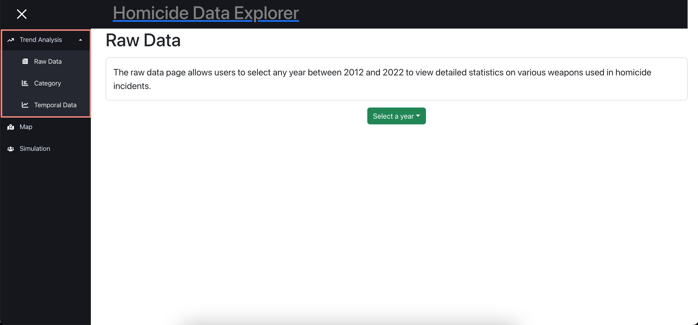
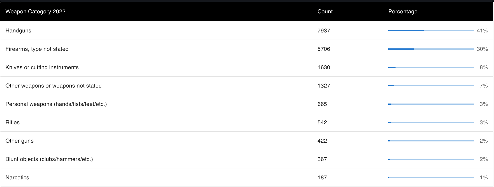
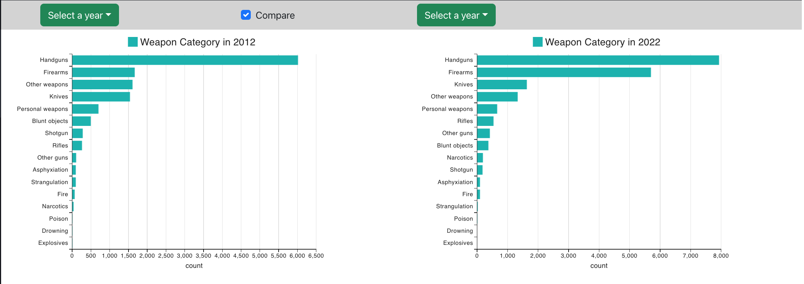
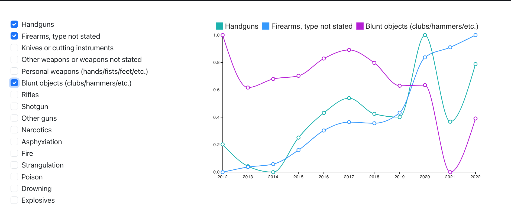
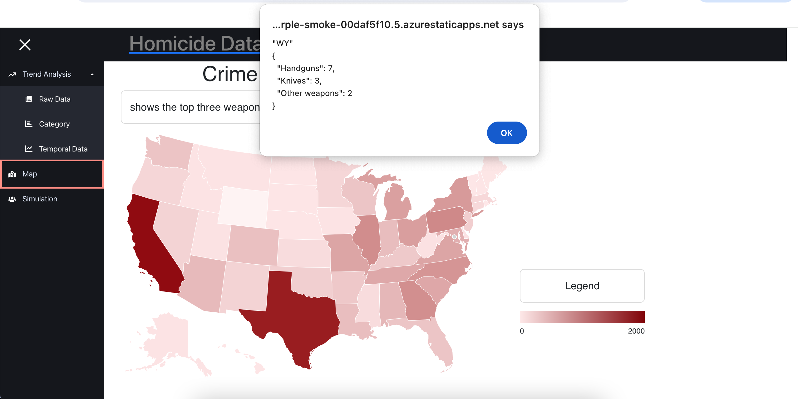
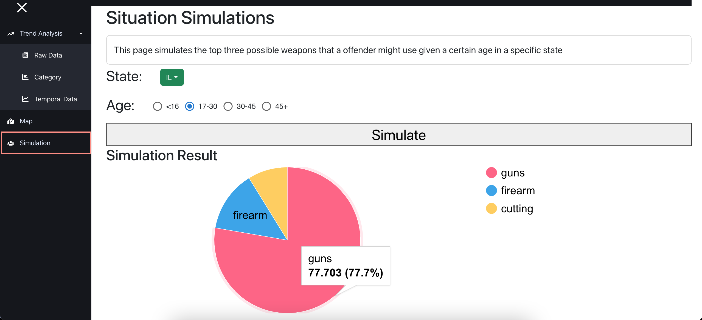

# Homicide Data Explorer

During our Visualization coursework, my partner and I developed a Homicide Data Explorer using weapon data from the FBI's homicide database. Our goal is to raise awareness about potential dangers in the surrounding environment.

We developed the website using React and deployed it on Azure (student trial).

## Key Features

- **Trend Analysis** displays the types of weapons used in homicides in the U.S. from 2012 to 2022 using various charts, such as line and bar charts. 

    

    - `Raw Data` shows the detailed statistics on various weapons used in homicide incidents based on selected year from 2012 to 2022
    

    - `Category` similar to Raw Data but shows in bar chart and users able to make comparison
    

    - `Temporal Data` displays the percentage of weapon usage over time from 2012 to 2022. Users can select and compare multiple weapons.
    

- **Map** displays a color-coded map indicating the severity of homicides in each state. When users click on a state, the top three weapons used in homicides within that state are shown.

- **Simulation** page simulates the top three possible weapons that a offender might use given a certain age in a specific state
 

